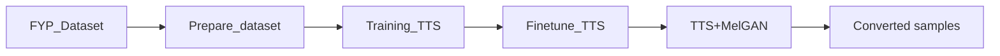

# English to Russian TTS with MelGAN

A research project that demonstrates English-to-Russian voice conversion using a fine-tuned Transformer-based TTS model and a MelGAN vocoder. The repository includes datasets, notebooks for data preparation, training, fine-tuning, and an inference demo.

## Diagram



## Highlights

- Fine-tuned Transformer TTS model for voice conversion.
- MelGAN vocoder for waveform synthesis.
- Google Colab notebooks for each stage.

## Quick Start (Colab)

1. Open Google Colab.
2. Upload the notebook for the stage you want to run.
3. Execute the cells in order.

Demo notebook:

- `TTS+MelGAN/TTS_MelGAN.ipynb`

## Repository Layout

```
English_to_Russian-TTS-MelGAN/
  Finetune_TTS/
  finetuned/
  FYP_Dataset/
  Prepare_dataset/
  Training_TTS/
  TTS+MelGAN/
  converted_samples/
  pretrained_tts_model/
  requirements.txt
```

## Requirements

- Python 3.8+
- Basic pip packages listed in `requirements.txt`
- System tools used in notebooks: `sox`, `bc`, `tree`

Install (local environment):

```bash
python3 -m venv venv
source venv/bin/activate
pip install -r requirements.txt
```

Note: The notebooks may install additional packages specific to each stage.

## Pretrained Model

If the `pretrained_tts_model` folder is missing or incomplete, download it from:

```
https://drive.google.com/open?id=167QyW-NLurvhYzIX8rnzlPbTtSDJpKK_
```

## Contact

For questions about the project or the dissertation, contact the author via email.
